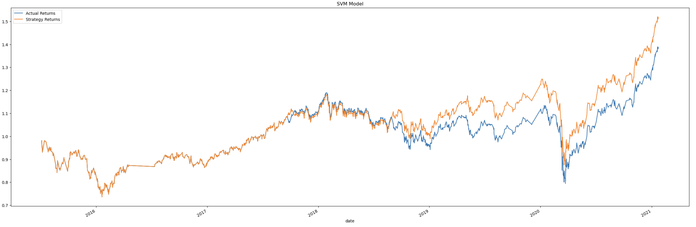
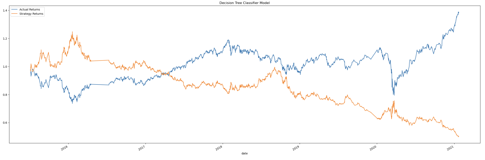
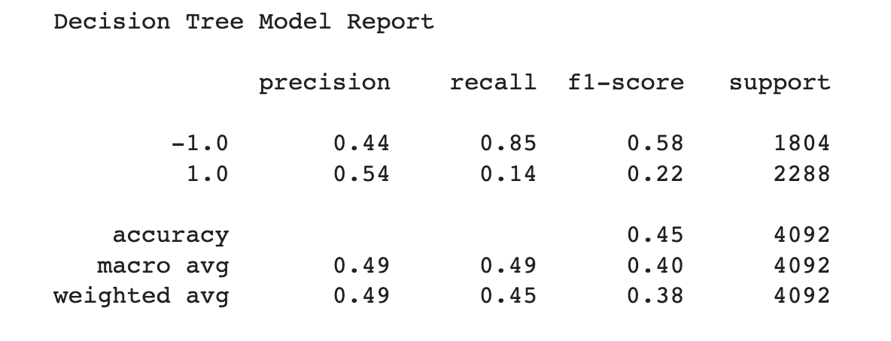
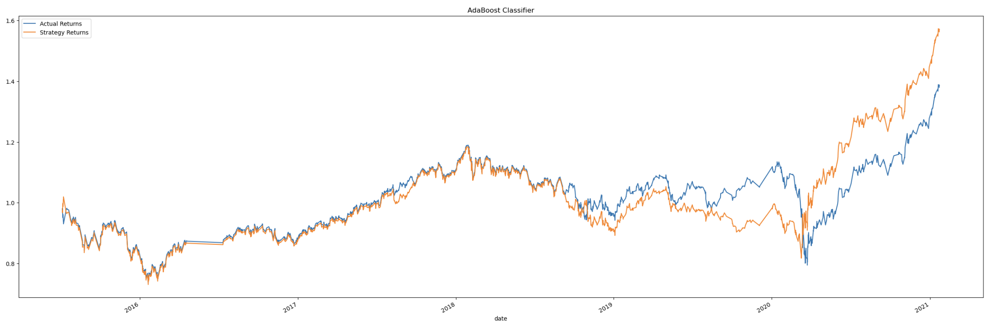
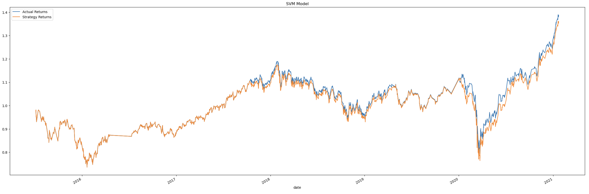
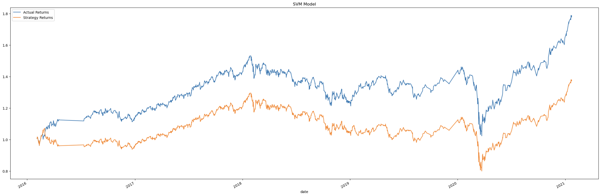
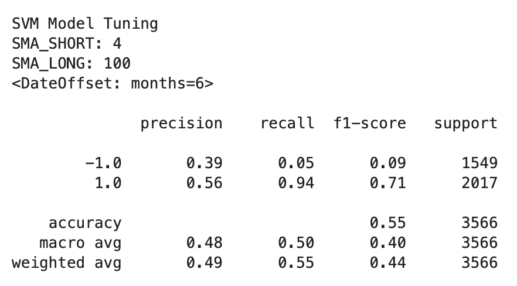
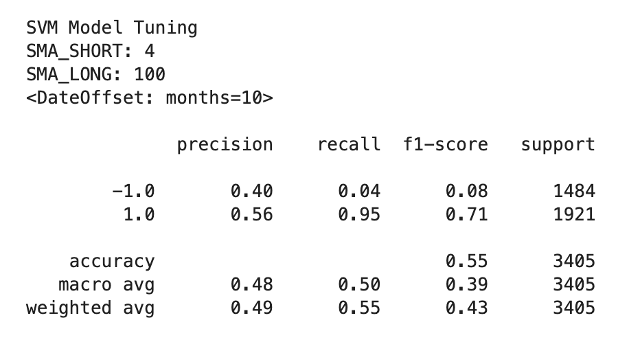

# Machine Learning Trading 

The project analyse and improve existing trading algorithms through machine learning models and make adjustments accordingly.

Below outlines the steps taken in the project:

1. [Establish a Baseline Performance](establish-a-baseline-performance)
2. [Tune the Baseline Trading Algorithm](tune-the-baseline-trading-algorithm)
3. [Evaluate a New Baseline Learning Classifier](evaluate-new-baseline-learning-classifier)
4. [Create a Evaluation Report](create-a-evaluation-report)

## Establish a Baseline Performance
* Import the OHLCV dataset into a Pandas DataFrame.
* Generate trading signals using short- and long-window (Short Moving Average) SMA values.
* Split the data into training and testing datasets.
* Use the SVC classifier model from SKLearn's support vector machine (SVM) learning method to fit the training data and make predictions based on the testing data.
* Generate and review the classification report associated with the SVC model predictions.
* Create a predictions DataFrame that contains columns for “Predicted” values, “Actual Returns”, and “Strategy Returns”.
* Create a cumulative return plot that shows the actual returns vs. the strategy returns.

### SVM Model

## Tune the Baseline Trading Algorithm
* Tune the model’s input features to find the parameters that result in the best trading outcomes. (You’ll choose the best by comparing the cumulative products of the strategy returns.) To do so, complete the following steps:
* Tune the training algorithm by adjusting the size of the training dataset.

## Evaluate a New Machine Learning Classifier
* Import a new classifier
* Using the original training data as the baseline model, fit another model with the new classifier.
* Backtest the new model to evaluate its performance.
* Answer the following questions: Did this new model perform better or worse than the provided baseline model? Did this new model perform better or worse than your tuned trading algorithm?

#### Logistic Regression Model

#### Decision Tree Model

#### AdaBoost Model

## Evaluation Report
### Tuning the Baseline Algorithm
* There are a few variables that were altered including:
    * short_window
    * long_window
    * DateOffset

These alterations created scenarios that output plots to indicate if the changes create either a net positive or net negative change.

The following outputs are detailed accounts of the tests conducted:

##### SVM Model
    sma_short = 5
    sma_long = 100
    DataOffset = 3

* During this testing the sma_short window was changed by one day (5). The results showed negative effects towards sell (-1) indicators and positive influence on buy (1) indicators. 

##### SVM Model
    sma_short = 5
    sma_long = 80
    DataOffset = 3
    
* During this testing the sma_long window was changed by twenty days (80). Decreasing the sma_long window indicated negative effects on the trading algorithm overall, but individual factors had positive outcomes. This indicates significant care should be taken if further analysis is conducted. 
  

##### SVM Model
    sma_short = 4
    sma_long = 100
    DataOffset = 6

* During this testing the original values of the short and long window were used with the DataOffset value altered. Overall, the data showed a positive increase in trends towards the end of the predictions. Recall and f1-score for sell are low, indication low reliability of the algorithmic change.
  

##### SVM Model
    sma_short = 4
    sma_long = 100
    DataOffset = 10
    
* During this testing the original values of the short and long window were used with the DataOffset value altered. Overall, the data showed a positive increase in trends towards the end of the predictions. Recall and f1-score for sell are low, indication low reliability of the algorithmic change.

Utilisation of different classifiers showed mixed results. Overall, incorporation of different classifiers with altered variables applied to each respective trading environment will be useful in model optimisation in the future. 
